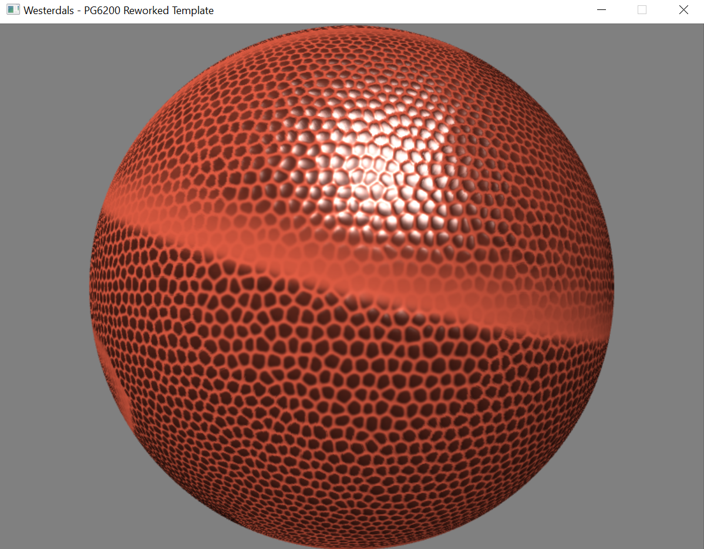
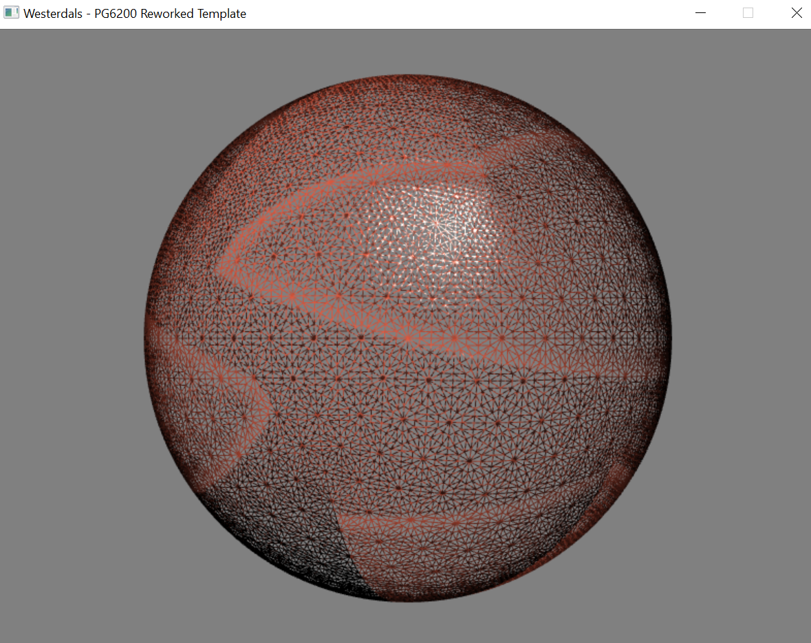
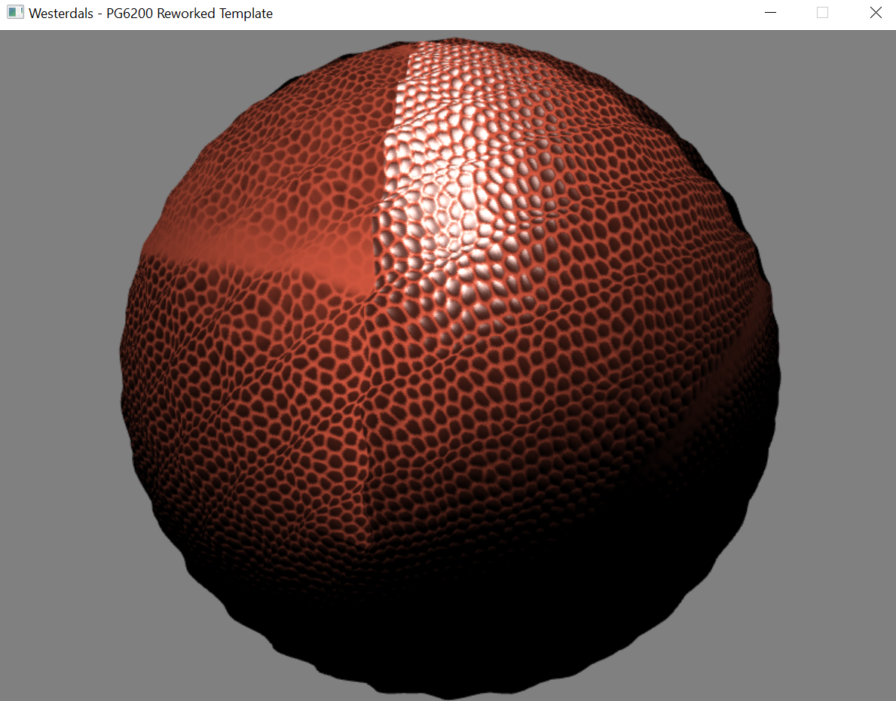
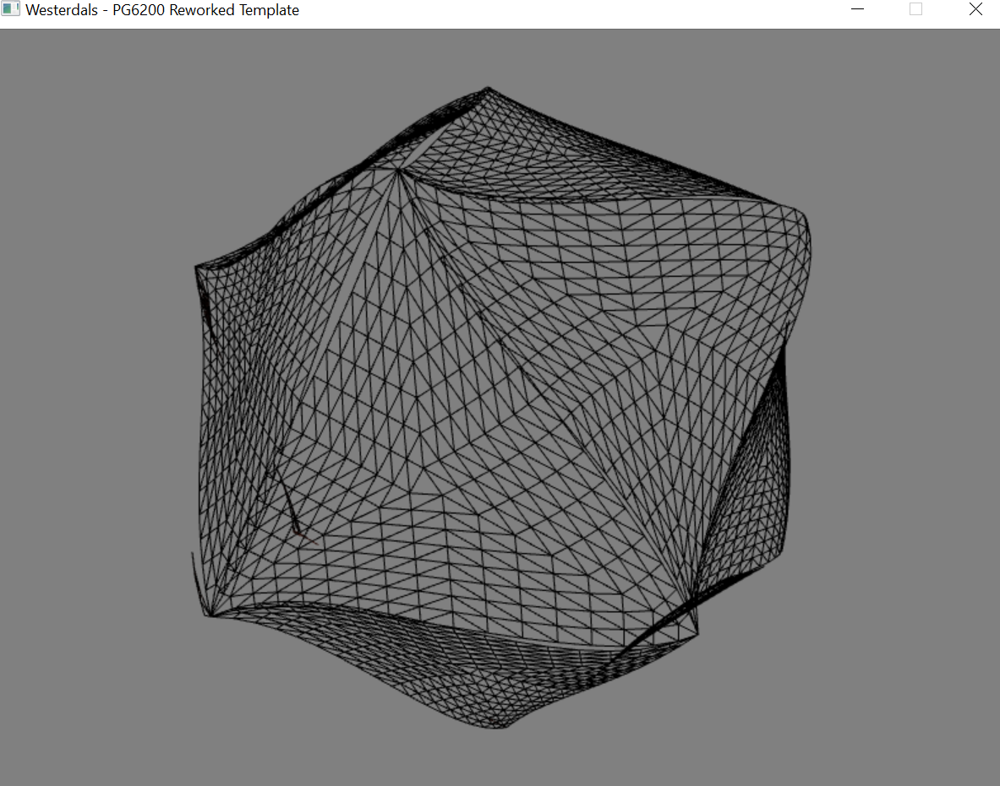

# PG6200 Assignment 2 - normal mapping and tessellation

## Required libraries
- [GLEW](http://glew.sourceforge.net/)
- [GLM 0.9.8.5](https://github.com/g-truc/glm/releases/tag/0.9.8.5)
- [SDL2](https://www.libsdl.org/)
- [ASSIMP](http://www.assimp.org/)
- [DevIL](http://openil.sourceforge.net/)

## Light mapping: diffuse, specular, and normals
To begin with, I added a VBO to contain the UV values loaded from the ball model, and load them in the vertex shader to use the GPU's interpolation function.

I started by including the diffuse texture and applying specular highlight according to the specular map included in the _textures_ folder of the assignment. The data from the specular map was interpreted as a factor for the shininess exponent of the standard lighting model (the lower the exponent, the shinier the fragment).

To prepare for normal mapping, I created the Tangent-Binormal-Normal (TBN) matrix in the vertex shader to transform light data from world space to "texture" space, so as to interprete light according to the coordinates provided in the normal map (in the fragment shader). The TBN was made by loading each vertex's tangent and binormal as calculated by ASSIMP upon loading of the model (although I initially calculated them through the help of [Tutorial 13][1], c.f. the commented-out _compute_tangent_space_ function in _Model.cpp_)

However, I got stuck for a while afterwards, as the assignment required the use of a normal map while the folder only contained a bump map texture. Until we received the actual normal map, I used the bump map as a series of angling factors to "bend" the vertex normal towards an arbitrary direction (around world Z axis), from white (1.0) pointing upwards (+Y), to black (0.0) pointing "right" (+X).

Only when the normal map was made available did I use the texture's normal values to include in the standard lighting system.

## Tessellation - curved Point-Normal (PN) triangles
I attempted to get a functioning tessellated model by using the curved Point-Normal triangles algorithm, using cubic Bézier patches. 

The algorithm consists of subdividing a not-yet-existing primitive into smaller triangles by placing a control point (CP) at 1/3 and 2/3 of each vertex on each edge linking the vertices of a face 2 by 2. I mention "not yet existing" as the subdivision happens in the Tessellation Control shader (TCS), i.e. before the primitives are created in the fixed-stage Primitive Generator (or Tesselator). Each primitive is then sent over to the Tessellation Evaluation shader (TES), where the actual interpolation is prepared by using the TES's integrated variable _gl_TessCoord_, which contains the 3 barycentric coordinates (4 if a quad is used instead of a triangle) of the created vertex on the current primitive. The vertex is placed according to the cubic function receiving those 3 coordinates (typically known as u, v and w).

Both TCS and TES were taken from [OGLdev's Tutorial 31][2] and adapted to fit our solution. However, while I managed to have LOD subdivision (either calculated by distance or set manually - c.f. the command listing in the console during the program execution), I could not get the cubic function to interpolate correctly. I believe the error has to come from the vertex normals (still in Model space, unlike those that will be used for the TBN matrix) and the view matrix, as the visual bugs are made clear only once the ball / camera view matrix is rotated.

This is more apparent when loading the icosahedron _ico-sphere.obj_. You can do so by commenting out line **149** and uncommenting line **150** in _GameManager.cpp_

### References
This assignment was completed by relying on the tutorials at the following pages:

#### Normal mapping: 
[opengl-tutorial - Tutorial 13 : Normal Mapping][1]

[OGL dev - Normal Mapping](http://ogldev.atspace.co.uk/www/tutorial26/tutorial26.html) 
#### Tessellation: 
[OGL dev - PN Triangles tessellation][2]

[1]:http://www.opengl-tutorial.org/intermediate-tutorials/tutorial-13-normal-mapping/
[2]:http://ogldev.atspace.co.uk/www/tutorial31/tutorial31.html